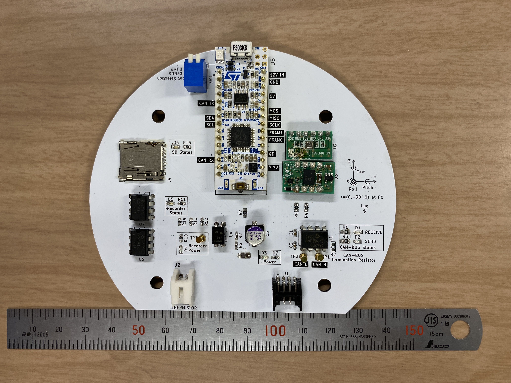

# 計測モジュール



## 概要

計装系サブシステムを担当するモジュール。エアデータを計測するセンサ類、データを保存するメモリ、これらをまとめるマイコンからなる。

### 機能

#### データ計測

センサを利用してデータを計測する。

##### 計測データ一覧

| 計測データ     | 使用センサ    | 出力レート |
| -------------- | ------------- | ---------- |
| 加速度         | BNO055        | 100Hz      |
| 角速度         | BNO055        | 100Hz      |
| 地磁気         | BNO055        | 20Hz       |
| クオータニオン | BNO055 (NDOF) | 100Hz      |
| 姿勢角         | BNO055 (NDOF) | 100Hz      |
| 重力加速度     | BNO055 (NDOF) | 100Hz      |
| 線型加速度     | BNO055 (NDOF) | 100Hz      |
| 気圧           | BME280        | 100Hz      |
| 外気温         | サーミスタ    | 20Hz       |

NDOFとは、BNO055が計測した加速度、角速度、地磁気の9軸から姿勢角など発展的なデータを算出してくれる機能。詳しくは「センサフュージョン」で調べてみてね。

#### データ算出

計測したデータを元に他のデータを算出する。

##### 算出データ一覧

| 算出データ | 使用データ | 出力レート |
| ---------- | ---------- | ---------- |
| 高度       | 気圧, 気温 | 50Hz       |
| 上昇率     | 高度       | 50Hz       |
| 上昇指数   | 高度       | 50Hz       |

上昇指数とは、頂点検知に使用する上昇の勢いを表す値。上昇率が高度変化を微分して算出されるのに対し、上昇指数は高度変化を2種類の指数移動平均にかけた差になっている。

#### 保存

計測したデータや解析用の補助的なデータを保存する。保存先はFRAMとマイクロSDカード。

#### 通信

CANBUSを介して他モジュールと通信する。

### ソフトウェア

ソースコード：[Sources/SensingModule.ino](./Sources/SensingModule/SensingModule.ino)

使用ライブラリ：

- Wire.h ... I2C用
- TaskManager.h ([hideakitai/TaskManager | Github](https://github.com/hideakitai/TaskManager)) ... 定期的に処理を実行するためのライブラリ
- CANSTM ([自作](../../../Libraries/CANSTM/)) ... STMマイコンをCANBUSに接続するためのライブラリ
- BNO055 ([自作](../../../Libraries/BNO055/)) ... 9軸センサBNO055用のライブラリ
- BME280 ([自作](../../../Libraries/BME280/)) ... 気圧センサBME280用のライブラリ
- Thermistor ([自作](../../../Libraries/Thermistor/)) ... サーミスタ用のライブラリ
- Switch ([自作](../../../Libraries/Switch/)) ... プルアップピンを使ったスイッチ用のライブラリ
- LED ([自作](../../../Libraries/LED/)) ... アウトプットピンを使ったLED用のライブラリ
- Trajectory ([自作](../../../Libraries/Trajectory/)) ... 高度算出や上昇率算出など軌道に関する計算用のライブラリ
- Logger ([自作](../../../Libraries/Logger/)) ... FRAMやSDへのデータ保存用ライブラリ
- Var ([自作](../../../Libraries/Var/)) ... 列挙型などの定数を定義したライブラリ

重要な関数は以下の7つ。

- `setup()`
- `loop()`
- `task02Hz()`
- `task2Hz()`
- `task20Hz()`
- `task50Hz()`
- `task100Hz()`

`setup()`は起動時に実行される関数。`loop()`は無限ループして実行される関数。`task○○Hz()`はその周波数で定期的に実行される関数。

詳細な解説は[こちら](./docs/Softwere.md)

### ハードウェア

## 製造

### 発注

ガーバーデータ：[KiCad/Gerber/Build_02/SensingModule.zip](./KiCad/Gerber/Build_02/SensingModule.zip)

Build_01は発注1回目、Build_02は発注2回目。修正版のBuild_02を発注すること。

### 実装

部品表：[KiCad/SensingModule/SensingModule.csv](./KiCad/SensingModule/SensingModule.csv)

### プログラム書き込み

Arduino IDE または Arduino CLI を用いで[ソースコード](./Sources/SensingModule/SensingModule.ino)を書き込む。

## 運用

### 通常運用

**SensingModule.ino**書き込み使用する。

コネクタ類はバスパワーラインとサーミスタを接続する。マイクロSDカードはFRAMとの冗長化のため使用すること。

### データダンプ

**LogDumper.ino**を書き込み使用する。

シリアルポートを接続すると5秒後からデータを出力する。

出力形式はscvでヘッダーはない。

```csv
millis,flightMode,outsideTemperature,pressure,altitude,climbIndex,isFalling,acceleration_x,acceleration_y,acceleration_z,gyroscope_x,gyroscope_y,gyroscope_z,magnetometer_x,magnetometer_y,magnetometer_z,orientation_x,orientation_y,orientation_z,linear_acceleration_x,linear_acceleration_y,linear_acceleration_z,gravity_x,gravity_y,gravity_z,quaternion_w,quaternion_x,quaternion_y,quaternion_z
```
