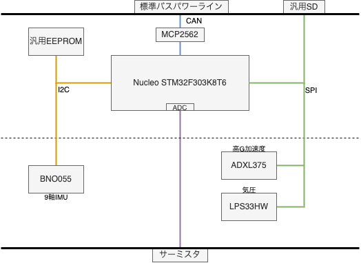

# 計測モジュール

データ計測と算出を行い、高レートで直接SDに保存するほか、CAN-BUSを介して他モジュールに必要な情報を提供する。

## 構成

## 基板形状

標準モジュール基板を継承

## 仕様

### 計測

|データ|センサ|ODR|
|-|-|-|
|加速度3軸|ICM20948|1kHz|
|ジャイロ3軸|ICM20948|1kHz|
|地磁気3軸|ICM20948|100Hz|
|高G加速度3軸|ADXL375|1kHz|
|気圧|LPS33HW|50Hz|
|気温|MAX31856|10Hz|

### 算出

|データ|元データ|ODR|
|-|-|-|
|クオータニオン|加速度, ジャイロ, 地磁気|100Hz|
|加速度(重力除去)|クオータニオン, 加速度|100Hz|
|姿勢角|クオータニオン|100Hz|
|速度|クオータニオン, 加速度|100Hz|
|高度|気圧, 気温|50Hz|

### データ出力

#### SDカード

- 加速度3軸(1kHz)
- ジャイロ3軸(1kHz)
- 地磁気3軸(100Hz)
- 高G加速度3軸(1kHz)
- 気圧(100Hz)
- 気温(10Hz)
- クオータニオン(100Hz)
- 加速度(重力除去)(100Hz)
- 姿勢角(100Hz)
- 速度(100Hz)
- 高度(50Hz)

#### CAN-BUS

- 加速度(重力除去)(100Hz)
- 姿勢角(100Hz)
- 速度(100Hz)
- 高度(50Hz)
