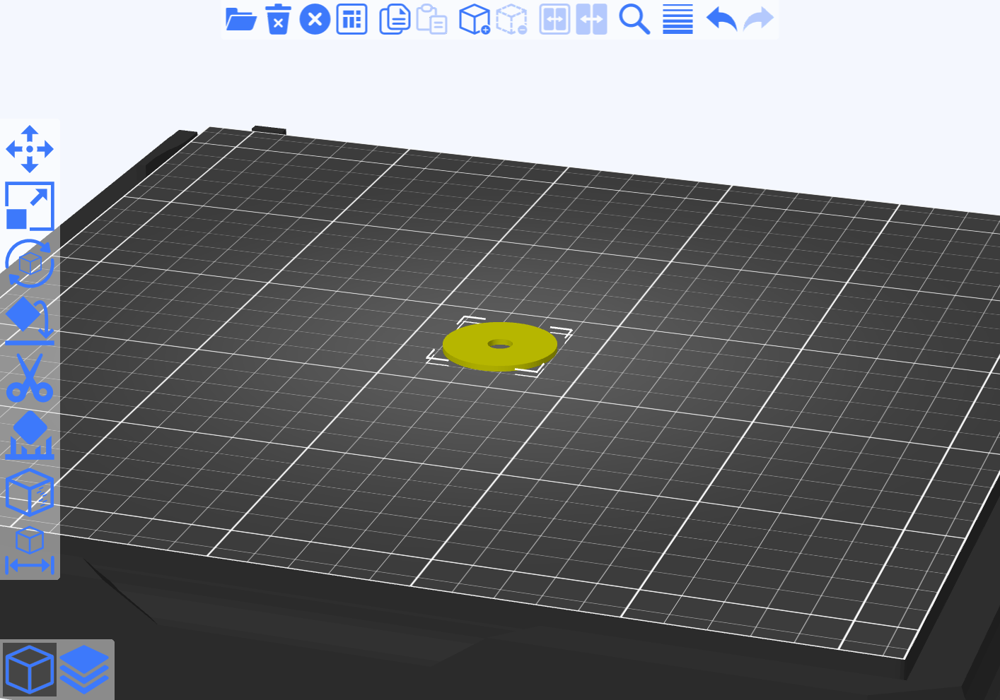
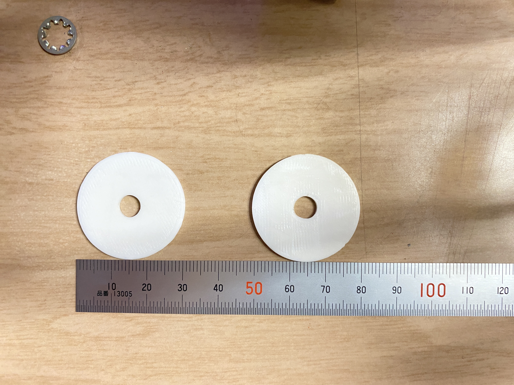
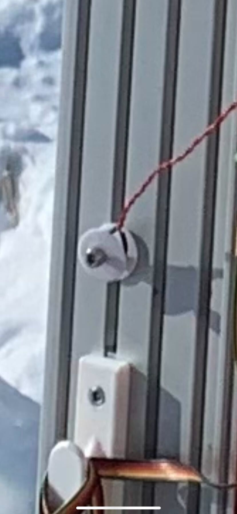

# くそでかワッシャー

## 概要
くそでかいワッシャーです．

フライトピンを固定するために使用します．

## Slicerでの様子

## 全体図

左上の金属ワッシャーに意味はありません

## 使用例

先入れナットを入れ，M6x25ネジで締結した様子です．
くそでかワッシャーでフライトピンを挟みランチャに締結を行います．

実際にランチャに取り付けた図です．
図右側に機体が挿入されています．機体から伸びているフライトピンがくそでかワッシャーを介してランチャに接続されています．

