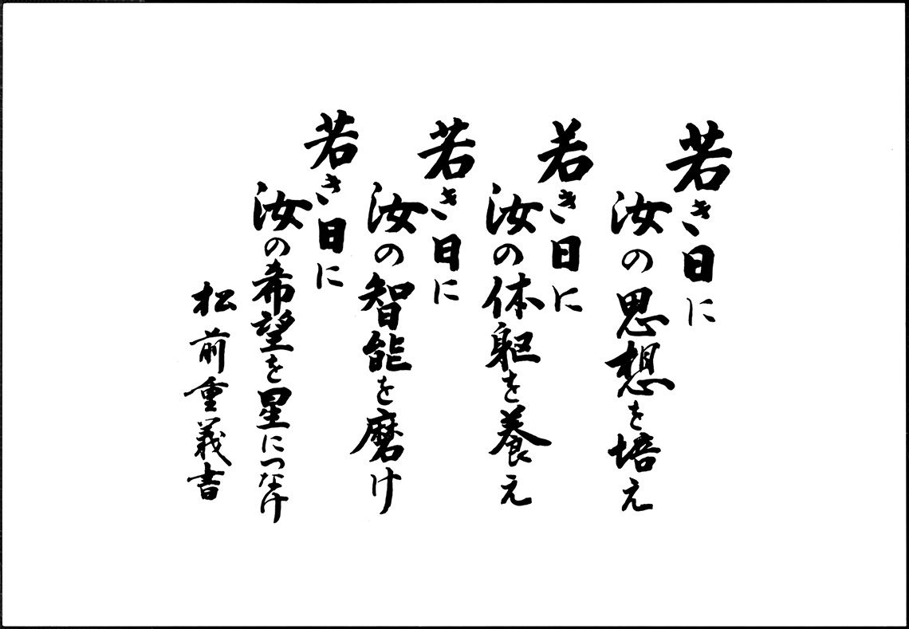

# THR制御モジュール

バルブ制御、バルブの状態、充填確認をCAN-BUSへ送信し計器タワーに情報を伝える基板です。

## 構成

## 近藤科学B3Mシリーズについて

### B3Mシリーズとは...?

近藤科学様が販売しているシリアル式サーボモーターになります。
高トルク、高耐久のサーボモーターとなります。
制御に使っているライブラリは『ICS Library for Arduino ver.2』を用いています。

> ICS Library for Arduino ver.2のダウンロードは[コチラ](https://kondo-robot.com/faq/ics-library-a2)

### Ics Library for Arduino ver.2 とは…？

近藤科学様が作成している主にKRSシリーズサーボモーターを制御するためのライブラリーです。
使用している関数を流用してB3Mシリーズサーボモーターを制御しています。

> KRSサーボモーターについては[コチラ](https://kondo-robot.com/product-category/servomotor/krs)

### 各種ドキュメント

**ハードウェア**
- [B3Mサーボ](/Documents/Datasheets/B3M/B3M_SoftwareManual1.2.0.3.pdf) [サーボ]

> ブラウザ版は[コチラ](https://kondo-robot.com/w/wp-content/uploads/B3M_SoftwareManual1.2.0.3.pdf)
- [LTC1480](/Documents/Datasheets/LTC1480/j1480_5.pdf) [RS485]

> ブラウザ版は[コチラ](https://www.analog.com/media/jp/technical-documentation/data-sheets/j1480_5.pdf)

- [MAX31855](/Documents/Datasheets/MAX31855/MAX31855_jp.pdf) [デジタルコンバーター]

> ブラウザ版は[コチラ](https://www.analog.com/media/en/technical-documentation/data-sheets/MAX31855.pdf)

- [MAX31856](/Documents/Datasheets/MAX31856/MAX31856_jp.pdf) [デジタルコンバーター]

> ブラウザ版は[コチラ](https://www.analog.com/jp/products/max31856.html#product-overview)

- [MCP2515](/Documents/) [CAN]

> ブラウザ版は[コチラ](https://akizukidenshi.com/download/ds/microchip/mcp2515_j.pdf)

- [MCP2562](/Documents/) [CAN]

> ブラウザ版は[コチラ](https://akizukidenshi.com/download/ds/microchip/MCP2562FD.pdf)
>

**ソフトウェア**

### ガバーデータ
- [Experiment Model](/Projects/KiCad/THRControlModuleBoard/Gaber/THRControlModule.zip)(2023/5/25に発注 -> 2023/5/30)
- [Proto Flight Model](/Projects/KiCad/THRControlModuleBoard/)
- [Flight Model](/Projects/KiCad/THRControlModuleBoard/)