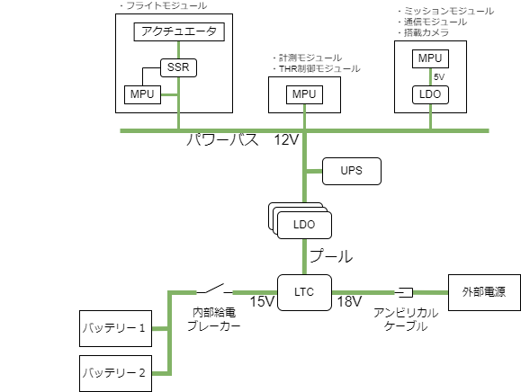
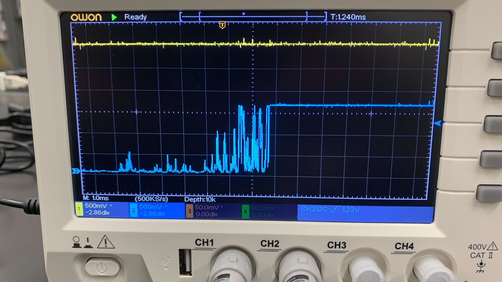
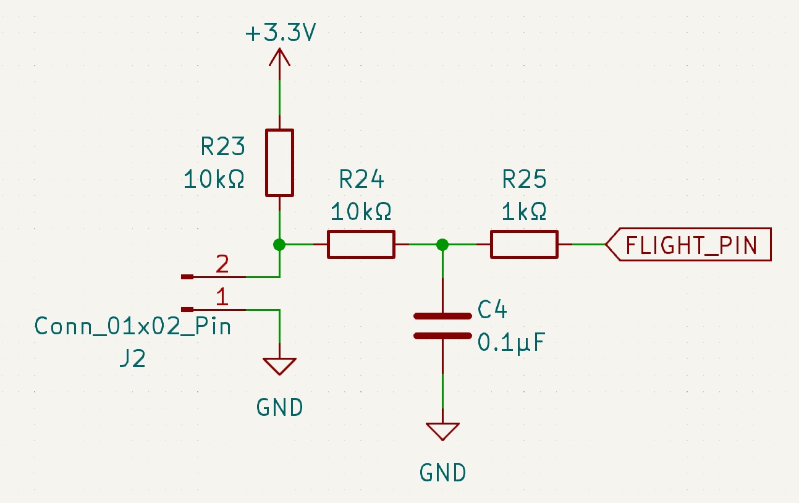
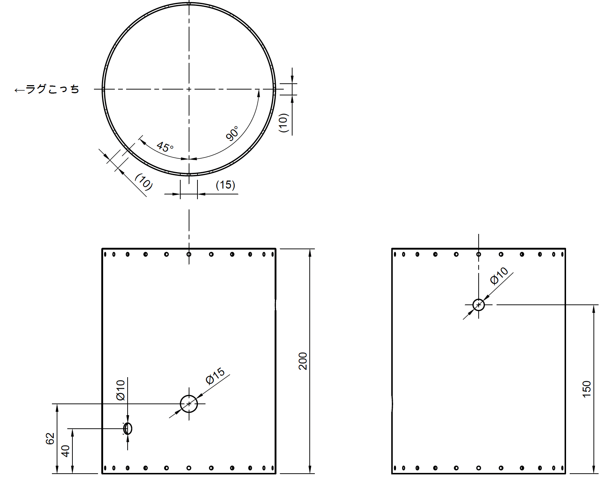

# 基本設計書

## 概要

### 特徴

#### 新規要素

- モジュール式の統合システム
- データバスの採用
- ±200g, 1kHz の加速度計測
- 熱電対による充填確認
- クオータニオンのリアルタイム算出

#### 強化要素

- Arduinoからステップアップした高性能マイコン
- 表面実装による小型化
- ダウンリンクの速度向上
- GPS取得頻度向上
- 配線の簡略化による運用性向上

#### 修正要素

- 点火前からの計測
- 外気温計測
- 頂点検知の感度調整

### 成功基準
<!-- 特徴毎に成功基準を設定（通信, ○○制御など） -->

|   ミッション   |      ミニマムサクセス      |         フルサクセス         |   エクストラサクセス   |
| :------------: | :------------------------: | :--------------------------: | :--------------------: |
| フライトモード | フライトピン開放で計測開始 |    バルブ開信号で計測開始    |   コマンドで計測開始   |
|    分離制御    |    強制分離 (タイマー)     | 精度向上のための制御情報取得 |  頂点分離 (頂点検知)   |
|   1kHz加速度   |      最低500Hzで計測       |       FRAMでデータ回収       | ダウンリンクの遅延送信 |
|    電源系統    |      安定した電力供給      |   バッテリー残量の遠隔監視   |     正常な電源切替     |
|    通信系統    |     ダウンリンクの受信     |        2Hz以上で受信         |     10Hz以上で受信     |

## システム
<!-- モジュール同士のデータ的な接続をシステム系統図で説明 -->

### モジュール

従来の共通計器, テレメータの統合を行い、各機能をモジュールとして分割して開発を行う。

システムを構成するモジュールは以下の通りである。

- 計測モジュール　... データ計測, 算出, 保存
- フライトモジュール ... フライトモード管理, 分離制御
- 通信モジュール
  - エアデータ ... 慣性情報, 高度情報のダウンリンク
  - システムデータ ... 制御情報, GNSS情報のダウンリンク, コマンドのアップリンク
- ミッションモジュール ... 1kHz加速度情報の計測, 保存, ダウンリンク
- THR制御モジュール ... バルブ制御, 充填確認

各モジュールはSTM32F303, ATSAMD21, ATSAMD11D14A, ATMega4809のいずれかをマイコンとして搭載しICを介してCAN-BUSに接続する。

### データバス
<!-- CAN-Busの採用とその効果を説明 -->

モジュール間のデータ的な接続のためにCAN-BUSを採用した。CAN-BUSは自動車で広く一般的に使われているデータ通信プロトコルである。通信速度は1Mbpsと必要十分であり、差動式信号のためノイズへの高い耐性を持つ。

データバスの採用により従来の煩雑な配線を減らし、拡張性の高いシステムを構成することができる。また、モジュール間は疎結合となることで、モジュールの開発が容易になり運用性の向上も期待できる。

### データフロー
<!-- データフロー図で説明 -->

### 電気系統
<!-- 外部給電を含めて電源系統図で説明 -->

## 機能

### 計測系

データ保存にはFRAM (Fujitsu MB85RS2MT) とマイクロSDカードを使用する。海打ち仕様として、着水時にFRAMとSDを電気的に遮断することでショートを防止する機構を搭載する。

データ保存はフライトモードオンのタイミングより開始する。 (概ね点火5~10秒前)

#### GNSS情報 (システムデータ通信モジュール)

| データ | センサ  | 出力レート | 出力先       | データ型 | 通信速度 |
| ------ | ------- | ---------- | ------------ | -------- | -------- |
| 緯度   | SAM-M8Q | 10Hz       | ダウンリンク | float    | 320bps   |
| 経度   | SAM-M8Q | 10Hz       | ダウンリンク | float    | 320bps   |
| 衛星数 | SAM-M8Q | 10Hz       | ダウンリンク | int16_t  | 160bps   |

#### 慣性情報 (計測モジュール)

| データ         | センサ        | 出力レート | 出力先                         | データ型      | 通信速度 |
| -------------- | ------------- | ---------- | ------------------------------ | ------------- | -------- |
| 加速度         | BNO055        | 100Hz      | FRAM, SD                       | float * 3axis | 9.6kbps  |
| ジャイロ       | BNO055        | 100Hz      | FRAM, SD                       | float * 3axis | 9.6kbps  |
| 地磁気         | BNO055        | 20Hz       | FRAM, SD                       | float * 3axis | 1.92kbps |
| クオータニオン | BNO055 (NDOF) | 100Hz      | FRAM, SD                       | float * 4axis | 12.8kbps |
| 姿勢角         | BNO055 (NDOF) | 100Hz      | FRAM, SD, ダウンリンク         | float * 3axis | 9.6kbps  |
| 線形加速度     | BNO055 (NDOF) | 100Hz      | FRAM, SD, ダウンリンク, 制御系 | float * 3axis | 9.6kbps  |
| 重力           | BNO055 (NDOF) | 100Hz      | FRAM, SD                       | float * 3axis | 9.6kbps  |
| 速度           | 算出          | 100Hz      | FRAM, SD, ダウンリンク         | float * 3axis | 9.6kbps  |

#### 高度情報 (計測モジュール)

| データ | センサ     | 出力レート | 出力先                         | データ型 | 通信速度 |
| ------ | ---------- | ---------- | ------------------------------ | -------- | -------- |
| 気圧   | BME280     | 100Hz      | FRAM, SD                       | float    | 3.2kbps  |
| 気温   | サーミスタ | 2Hz        | FRAM, SD                       | float    | 64bps    |
| 高度   | 算出       | 100Hz      | FRAM, SD, ダウンリンク, 制御系 | float    | 3.2kbps  |

#### 1kHz加速度 (ミッションモジュール)

| データ | センサ  | 出力レート | 出力先             | データ型      | 通信速度 |
| ------ | ------- | ---------- | ------------------ | ------------- | -------- |
| 加速度 | ADXL375 | 1kHz       | FRAM, ダウンリンク | float * 3axis | 96kbps   |

#### 電圧監視 (フライトモジュール)

12V供給, バッテリー電圧, プール電圧を監視する。これにより、遠隔で電池残量の推測や電源の切替状況を監視することができる。

正常値の監視電圧を分圧回路により2.4Vに降圧した後、ADCで電圧を読み取る。これに係数を乗ずることで元の電圧を取得する。

### 制御系

#### フライトモード (フライトモジュール)

状態をフライトモードで管理する。既定の条件を満たすことで次のモードに遷移する。モード遷移時にイベントを発行してダウンリンクで送信する。

頂点一段階分離では頂点検知により直接Parachuteモードへ遷移するため、DescentモードとDecelモードは飛ばされる。

| モード    | 遷移条件                                          | 動作                                  | 備考                       |
| --------- | ------------------------------------------------- | ------------------------------------- | -------------------------- |
| Sleep     | 電源投入                                          | なにもしない, コマンドは受け付ける    |                            |
| Standby   | WakeUpコマンド or Launch信号 (通信不可時)         | 計測開始                              | フライトモードオン         |
| Thrust    | 離床検知                                          | タイマ開始                            |                            |
| Climb     | 想定モータ作動時間                                | マージン後頂点検知許可 (分離保護時間) |                            |
| Descent   | 頂点検知                                          | すぐにDecelへ遷移 (頂点分離)          | 頂点分離では実質飛ばされる |
| Decel     | タイマー (一段目強制分離時間) or 緊急分離コマンド | 一段目分離                            | ドローグシュート展開       |
| Parachute | 指定高度到達 or タイマー (二段目強制分離時間)     | 二段目分離                            | メインシュート展開         |
| Land      | タイマー (想定着地時間)                           |                                       |                            |
| Shutdown  | タイマー (シャットダウン時間)                     | 計測終了                              |                            |

#### 離床検知 (フライトモジュール)

フライトピンの離脱による回路切断をプルアップ入力で検知する。チャタリング対策には従来のソフトウェア実装からハードウェア実装に変更した。これにより、発生する遅延を10ミリ秒から2ミリ秒に短縮した。

|                          対策前                          |                          対策後                          |
| :------------------------------------------------------: | :------------------------------------------------------: |
|  |  |

以下にチャタリング除去回路を示す。

#### 頂点検知 (フライトモジュール)

H-57で得た改善モデルにより、平滑化定数を0.5とした指数移動平均によって平滑化した高度変化が5回連続で減少したことを検知する。

以下にH-57のフライトデータを例にした頂点検知を示す。初めに連続降下回数を閾値が越えたX+9.57秒後 (実際の頂点到達の0.35秒後) に頂点検知が行われることがわかる。

#### 分離制御 (フライトモジュール)

頂点検知による頂点分離及び、バックアップとしてタイマーによって分離信号を出す。

制御回路を以下に示す。CONTROL_SEPARATOR_0はマイコンからの3.3V信号であり、分離時には1.65Vに分圧してフォトカプラの1次側に供給する。2次側には別系統の12V電源が接続され、不知火の電磁弁 (HNB1-M5-DC12V) に3秒間12Vを供給する。

#### カメラ制御 (フライトモジュール)

搭載カメラへ録画開始/終了の信号を送る。

録画開始は計測開始と同時、録画終了は動画の保存処理が必要なため想定着地時間の数秒前とする。

### 信号検知（THR制御モジュール）

GSEからの信号を検知し

### 通信系

無線通信はLoRa920MHz帯を3系統使用する。チャンネルは電波産業会 (ARIB) に従い今後決定する。

#### エアデータ通信モジュール

慣性情報と高度情報をダウンリンクで送信する。

#### システムデータ通信モジュール

フライトモード, 制御情報, 電圧情報, GNSS情報をダウンリンクで送信する。また、コマンドをアップリンクで受信する。

#### ミッションモジュール

1kHz加速度情報をダウンリンクで送信する。

ダウンリンクの通信速度がボトルネックであるため、計測したデータは一度FRAMに保存して点火から3秒程度分のデータを200Hzで送信する遅延送信を行う。

### 電源系

供給した電力をリニアレギュレーターで12Vに降圧した後、CAN-BUSに併設したバスパワーラインを通して各モジュールに分配する。

供給には内部給電と外部給電の経路があり、LTC4416によって選択が行われ外部給電が優先して使用される。外部給電はアンビリカルケーブルを介して地上に設置された安定化電源に接続され、離床時に切り離される。内部給電は3V出力電池の5直列を2並列としたラダー接続であり、大容量化を行った。

電源投入時には内部電源遮断用のブレーカースイッチの操作を要する。

瞬電対策として100μFのハイブリッド導電性高分子アルミニウム個体電解コンデンサを9個搭載することで、1A定電流放電としたとき4.5ミリ秒の瞬電に耐えられる。

## 構造
<!-- 計器タワーやバルブカプラへの搭載部分をCADなどで説明する -->

計器タワーの高さは搭載カメラを含め142.2mmである。

ブレーカースイッチ操作用として下に示す位置に穴が必要である。

## スケジュール

基板設計を終わらせ発注を行うことを優先したため、ソフトウェア側の開発は最低限の進捗。
5/25に基板発注を行ったため、6月上旬には基板製造が終わる。

- 要件定義 ←済
- 概念設計 ←済
- 部分設計 ←済
- モジュール設計 ←済
- システム設計
- 基板設計 ←済
- 基板製造
- 動作試験
