# 組み立て手順書

| 種別     | 所要時間 | 最低人員 |
| -------- | -------- | -------- |
| 通常運用 | 20分     | 1人      |

計器タワーの組み立て手順です。計器チューブ取り付けから機体搭載は[機体搭載手順書](MountingProcedure.md)を参照してください。

## 必要物品

### 部品

写真はこちら -> [部品一覧](../PartsList.md)

- 基板
  - [ ] 1x 電池ボックス基板
  - [ ] 1x 変圧基板
  - [ ] 1x バルブ制御モジュール基板
  - [ ] 1x 計測モジュール基板
  - [ ] 1x フライトモジュール基板
  - [ ] 1x ミッションモジュール基板
  - [ ] 1x エアデータ通信モジュール基板
  - [ ] 1x システムデータ通信モジュール基板
  - [ ] 1x カメラモジュール基板
- 構造
  - [ ] 1x 計器ベースプレート
  - [ ] 4x M4x20mm スペーサー
  - [ ] 28x M4x10mm スペーサー
  - [ ] 24x M4 ワッシャー
  - [ ] 4x M4 ナット
  - [ ] 6x アンテナ固定用タイラップ
- 配線
  - [ ] 1x VREF配線
  - [ ] 1x SN3配線
  - [ ] 1x CAMERA配線

### 工具

- [ ] M3,M4 スパナ

## 手順

### 0. 計器ベースプレートの準備

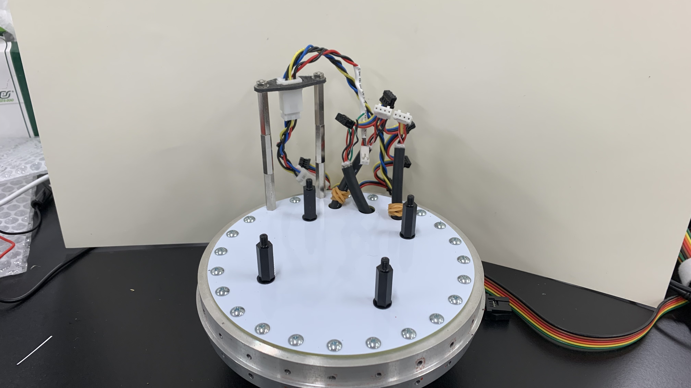

> 1x 計器ベースプレート

運用時は写真の状態から解体することはありません。

### 1. 電池ボックス基板取り付け

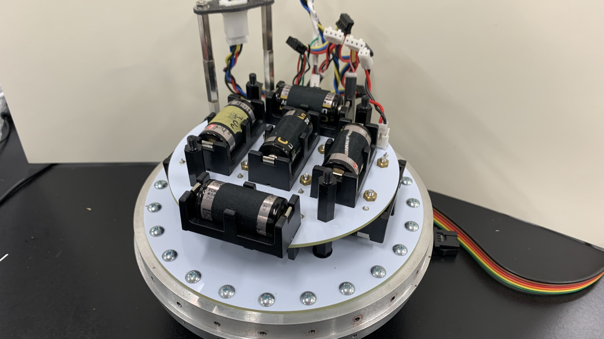

> 1x 電池ボックス基板
> 4x M4x20mm スペーサー

基板の裏表に注意してください。コネクタのある面が表です。

スペーサーの取り付けトルクは「手締めで限界まで+スパナで30°」を目安にしてください。

### 2. 変圧基板取り付け

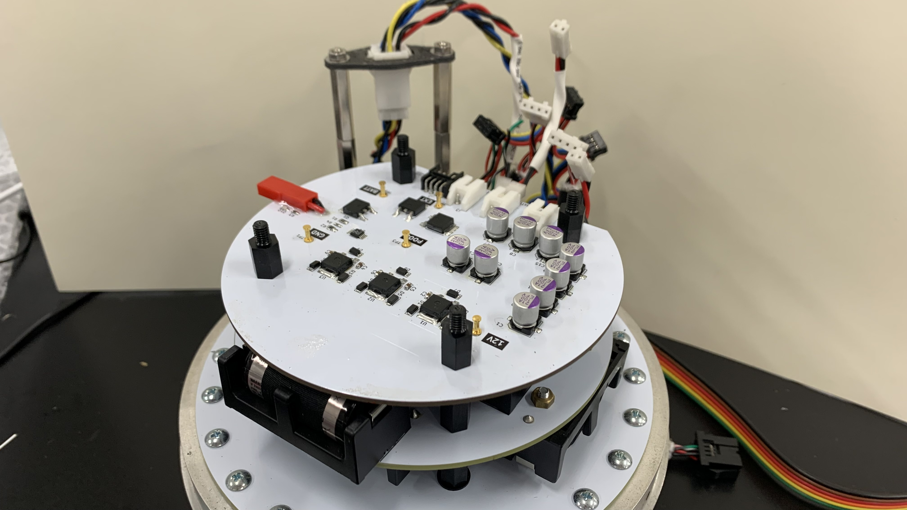

> 1x 変圧基板
> 4x M4x10mm スペーサー
>
> ### 3. バルブ制御モジュール基板取り付け

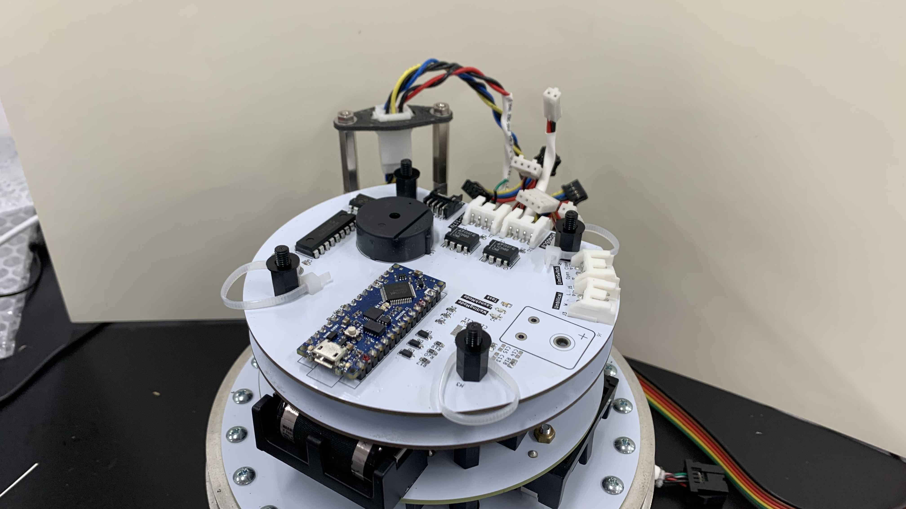

> 1x バルブ制御モジュール基板
> 4x M4x10mm スペーサー
> 3x アンテナ固定用タイラップ
> 4x M4 ワッシャー

アンテナ固定用タイラップを忘れずに。

### 4. 計測モジュール基板取り付け

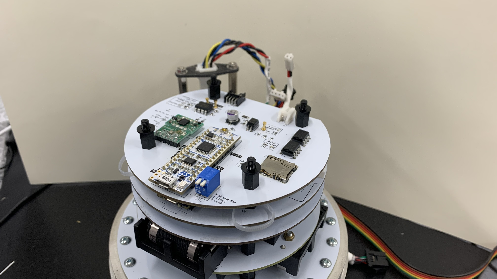

> 1x 計測モジュール基板
> 4x M4x10mm スペーサー
> 4x M4 ワッシャー

### 5. フライトモジュール基板取り付け

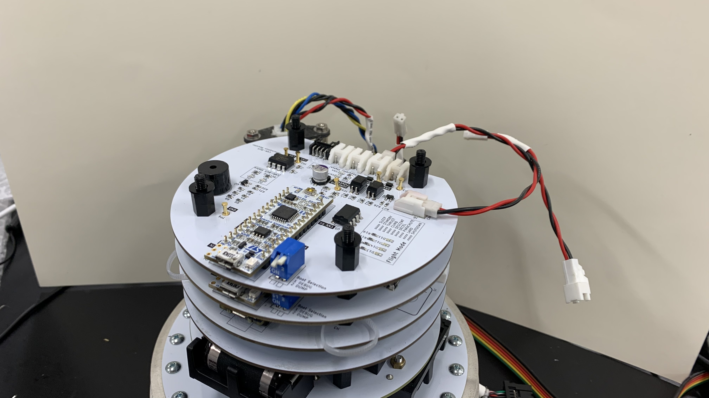

> 1x フライトモジュール基板
> 4x M4x10mm スペーサー
> 4x M4 ワッシャー

### 6. ミッションモジュール基板取り付け

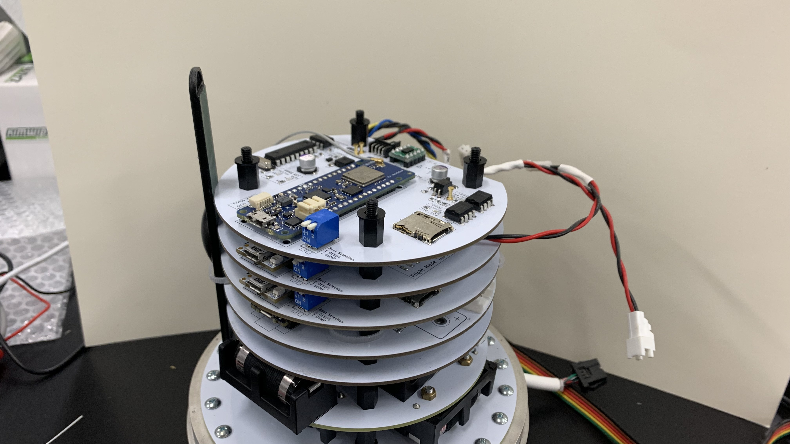

> 1x ミッションモジュール基板
> 4x M4x10mm スペーサー
> 4x M4 ワッシャー

### 7. エアデータ通信モジュール基板取り付け

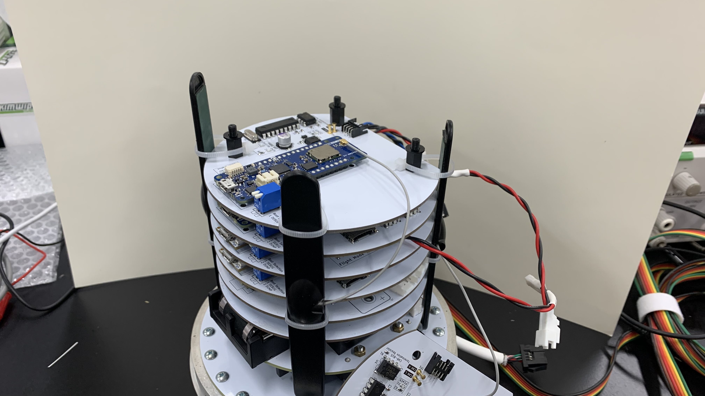

> 1x エアデータ通信モジュール基板
> 4x M4x10mm スペーサー
> 3x アンテナ固定用タイラップ
> 4x M4 ワッシャー

アンテナ固定用タイラップを忘れずに。

次に取り付けるシステムデータ通信モジュールのアンテナもこのタイミングで固定しましょう。

### 8. システムデータ通信モジュール基板取り付け

TODO: 写真追加

> 1x システムデータ通信モジュール基板
> 4x M4x10mm スペーサー
> 4x M4 ワッシャー

### 9. カメラモジュール基板取り付け

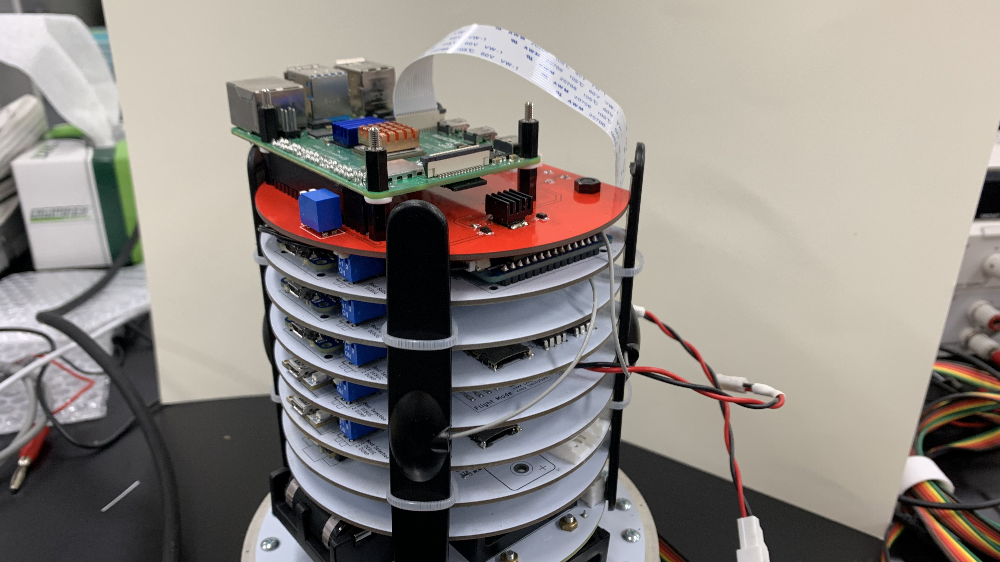

> 1x カメラモジュール基板
> 4x M4 ナット

### 10. 配線接続

#### 10.1. データバス接続

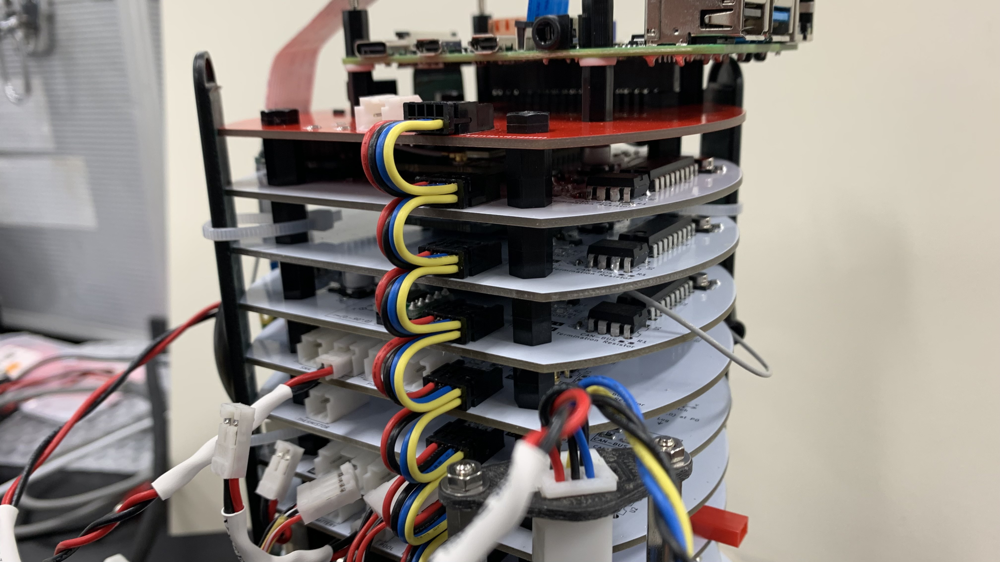

#### 10.2. 変圧基板の配線

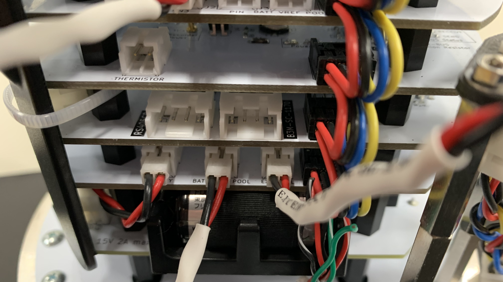

> VREF配線

1. 電源基板(15V) ----> 変圧基板(BATT)
2. --[VREF]--> 変圧基板(VREF)
3. アンビリカルケーブルコネクタ --[EXTERNAL]--> 変圧基板(EXTERNAL)

#### 10.3. バルブ制御モジュール基板の配線

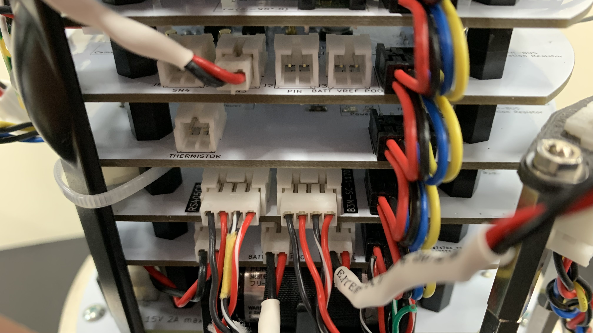

1. ----> バルブ制御モジュール基板(RS405CB)
2. ----> バルブ制御モジュール基板(B3M-SC-1170)

左は左、右は右。クロスしていなければ大丈夫。

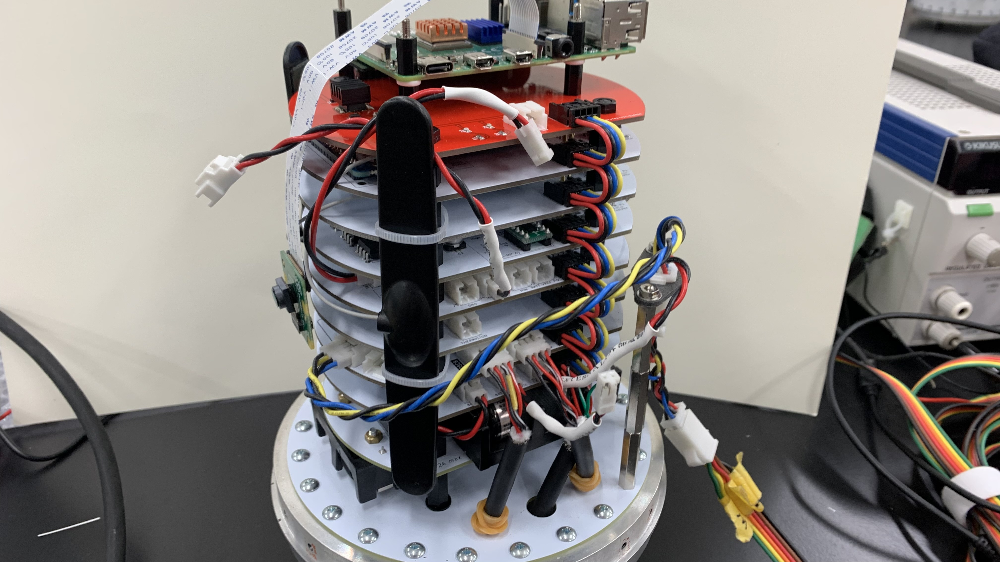

3. アンビリカルケーブルコネクタ ----> バルブ制御モジュール基板(Umbilical)

#### 10.4. 計測モジュール基板の配線

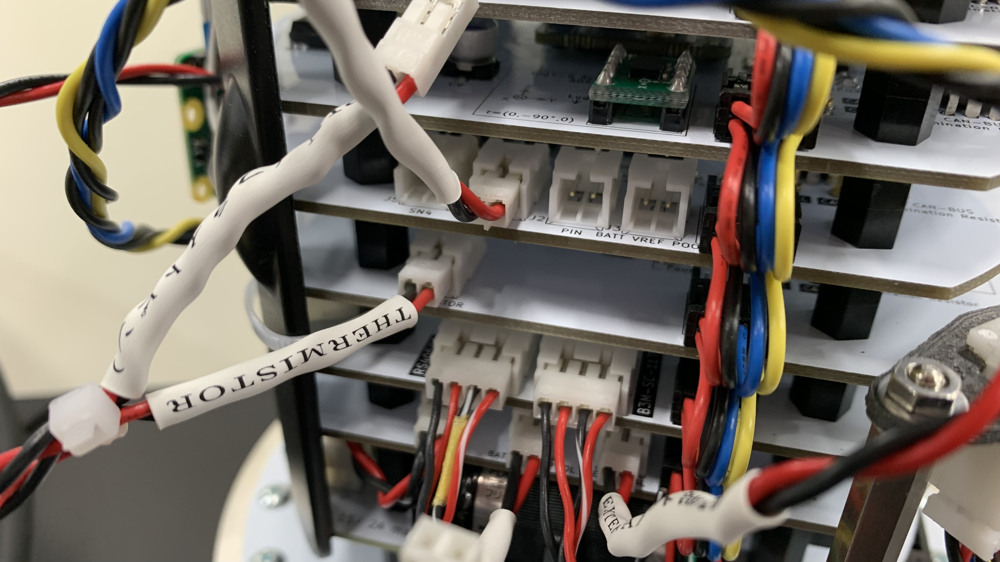

1. アンビリカルケーブルコネクタ --[THERMISTOR]--> 計測モジュール基板(THERMISTOR)

#### 10.5. フライトモジュール基板の配線

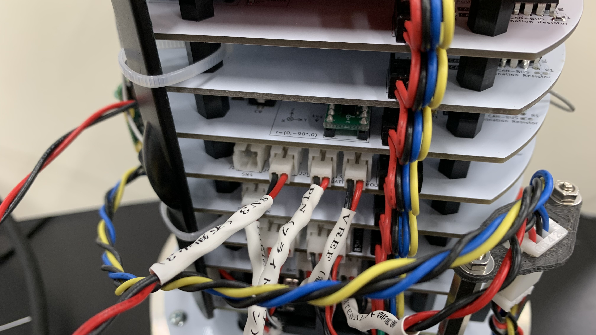

> SN3配線

1. --[SN3]--> フライトモジュール基板(SN3)
2. アンビリカルケーブルコネクタ --[PIN]--> フライトモジュール基板(PIN)
3. 変圧基板(VREF) --[VREF]--> フライトモジュール基板(VREF)

SN4は非接続です。

#### 10.6. カメラモジュール基板の配線

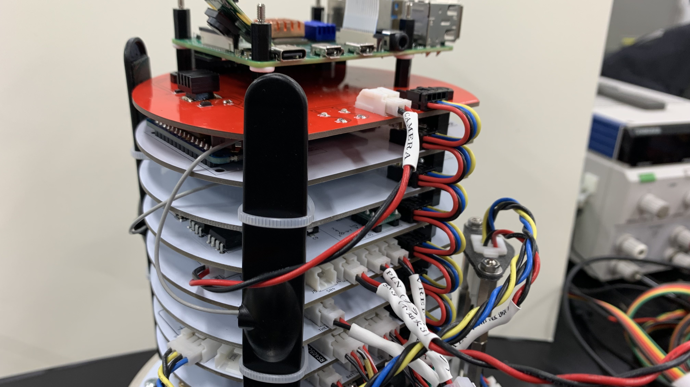

> CAMERA配線

1. フライトモジュール(CAMERA) --[CAMERA]--> カメラモジュール基板

## チェックリスト
