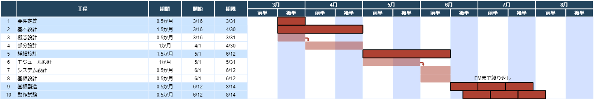

# 工程計画書

DRと安全審査の時期が未定なので暫定版

## 工程

### 要件定義

成果物: **要件定義書**  
期限: **3月末**

- ミッションや他班からの要求をまとめる。
- 必要な計測項目や制御項目を洗い出す。

### 基本設計

成果物: **基本設計書**(=issueや各モジュールREADMEのまとめ)  

#### 概念設計

期限: **3月末**

- 具体的な部品や技術の選定

#### 部分設計

期限: **4月末**

- センサや制御部分単位で細分化したBBMを作り、周辺回路やプログラムの実装方法を確認

### 詳細設計

成果物: **詳細設計書**  

#### モジュール設計

期限: **5月末**

- モジュール毎のBBMを作る
- モジュール動作試験

#### システム設計

期限: **6月半ば**

- 全てのモジュールを繋げてシステムとして動かす
- システム動作試験

#### 基板設計

期限: **6月半ば**

- 詳細な回路図, ボード図を作成

### 基板製造

成果物: **EM基板 or FM基板**  
期間: **2週間**

- 基板発注
- 部品実装

### 動作試験

成果物: **運用手順書, 安全審査書**  
期間: **2週間**

- EM基板を試験する
- 問題があれば、設計を修正して**基板製造**から繰り返す
- 問題が無ければ、FM基板に昇格
