# 組み立て手順書

## 使う部品の紹介

### 計器ベースプレート

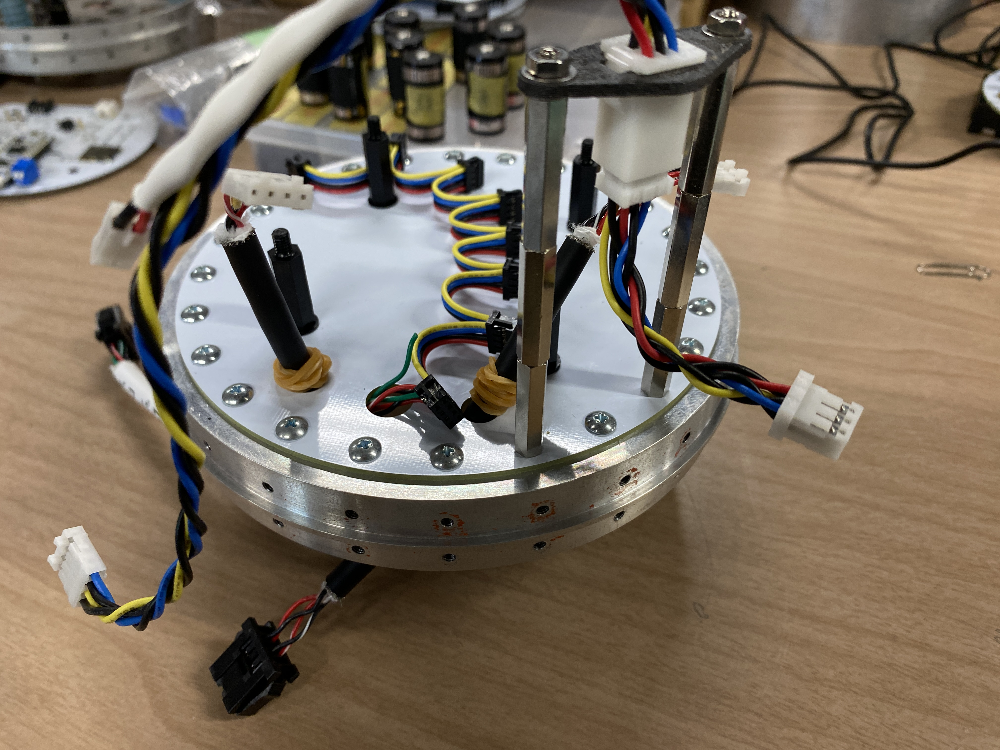

標準カプラに計器ベープレートが締結され、スペーサーとアンビリカルケーブルコネクタパネルが取り付けられた状態。

### 基板

使用する基板たちです。裏面に基板の名称とソースコードへのQRコードが記載されているので参考にしてください。

#### 電池ボックス基板

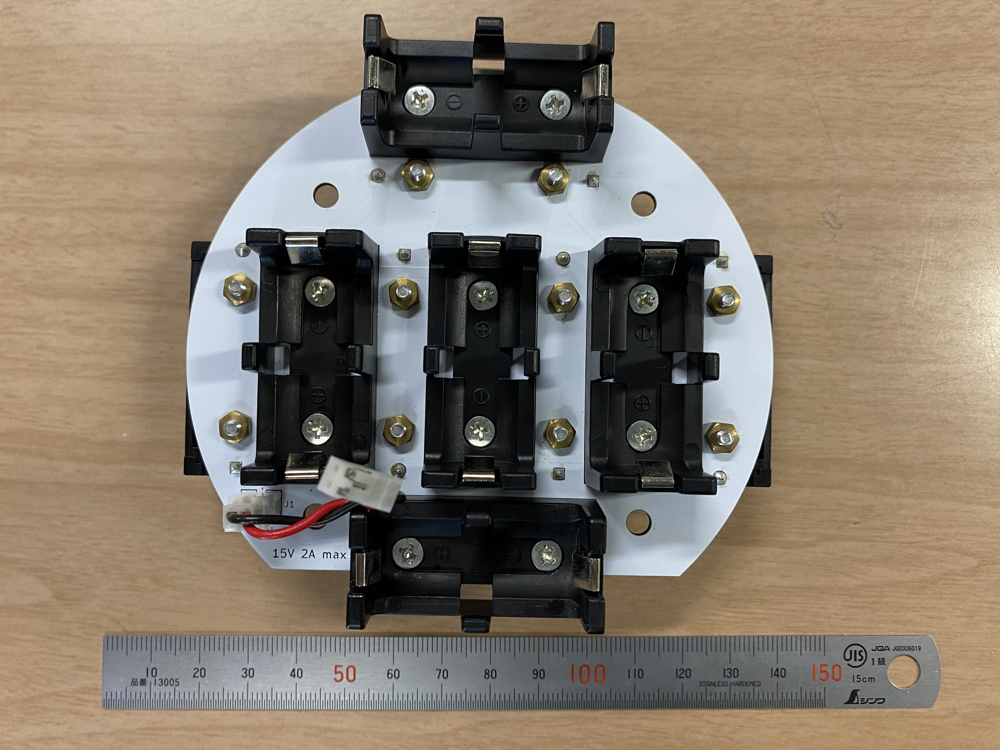

#### 変圧基板

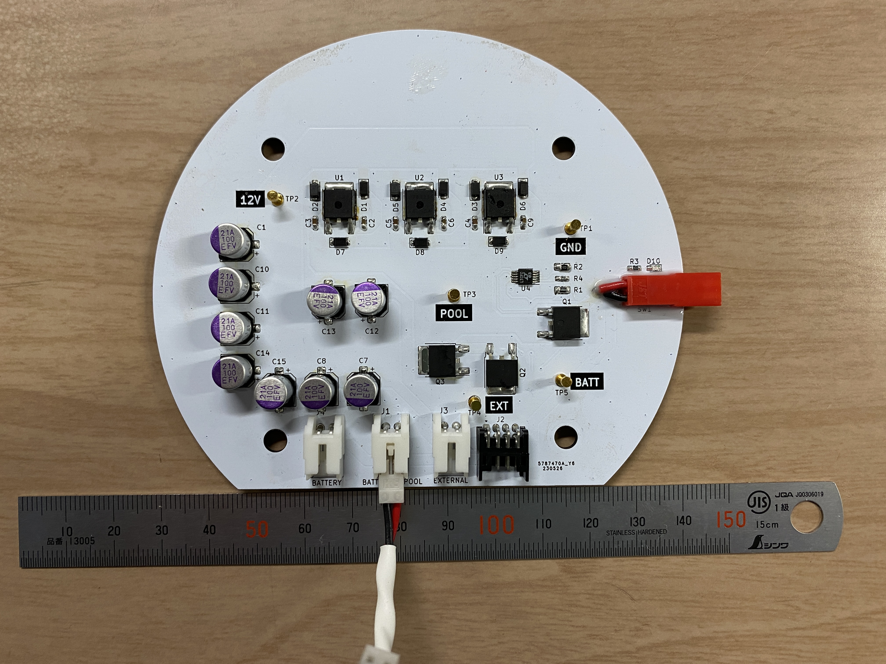

#### バルブ制御モジュール基板

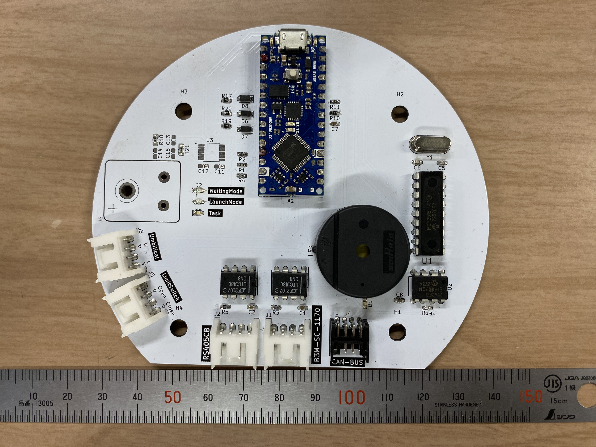

#### 計測モジュール基板

#### フライトモジュール基板

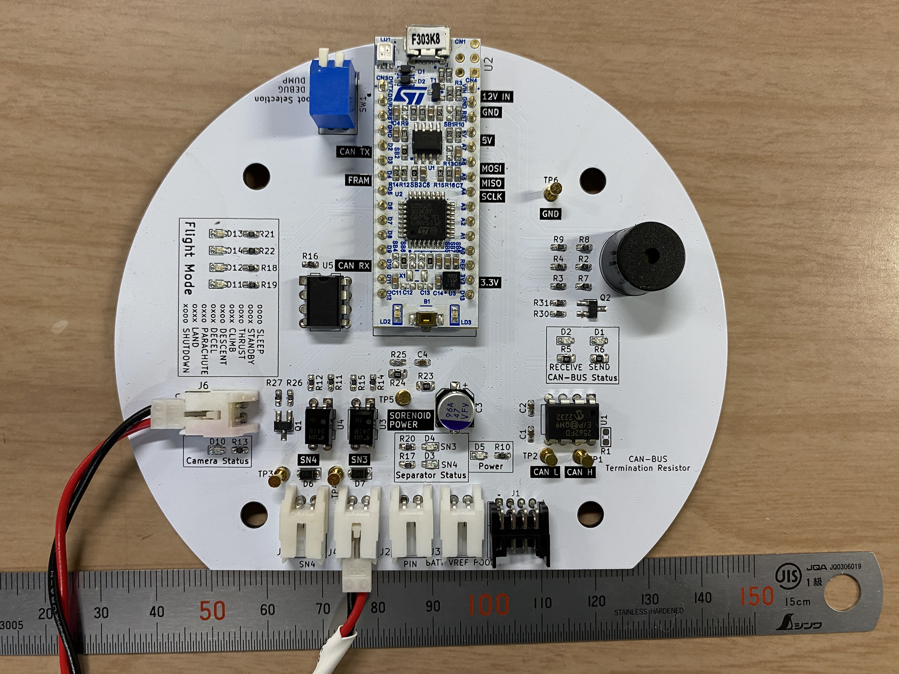

#### ミッションモジュール基板

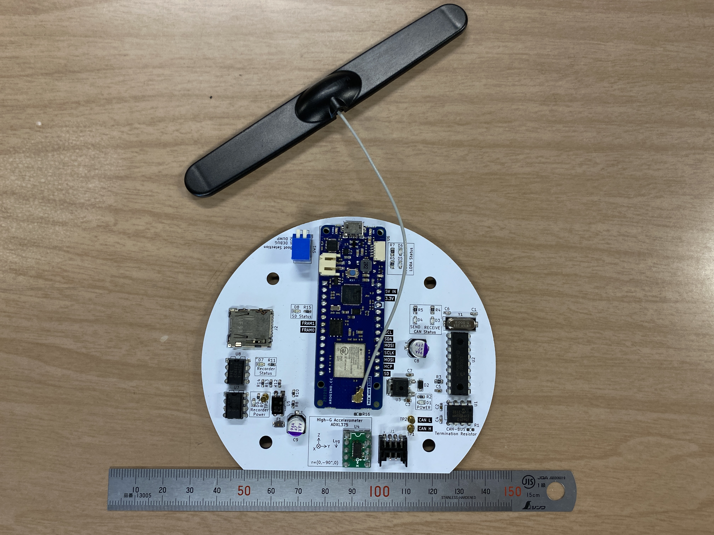

#### エアデータ通信モジュール基板

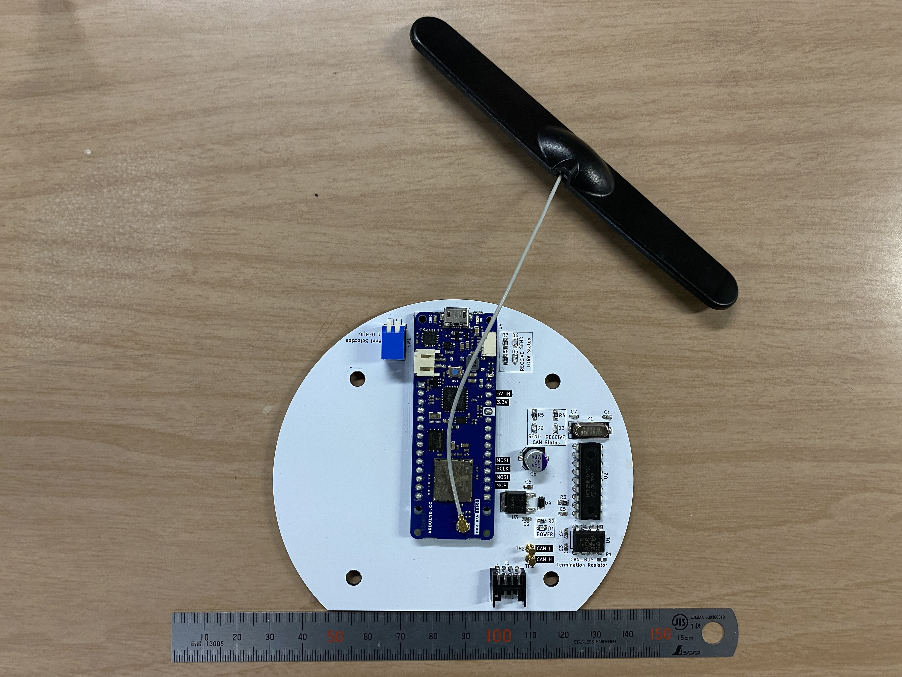

#### システムデータ通信モジュール基板

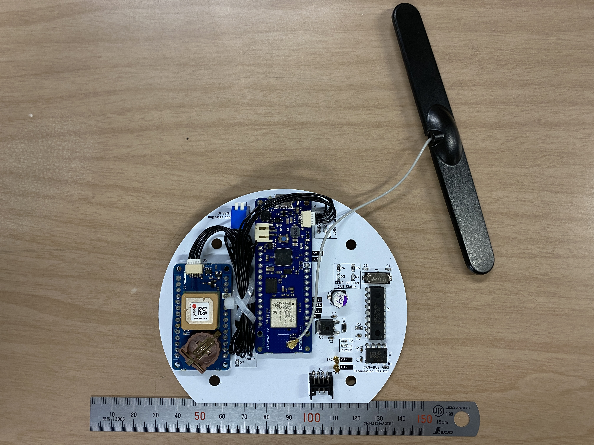

#### カメラモジュール基板

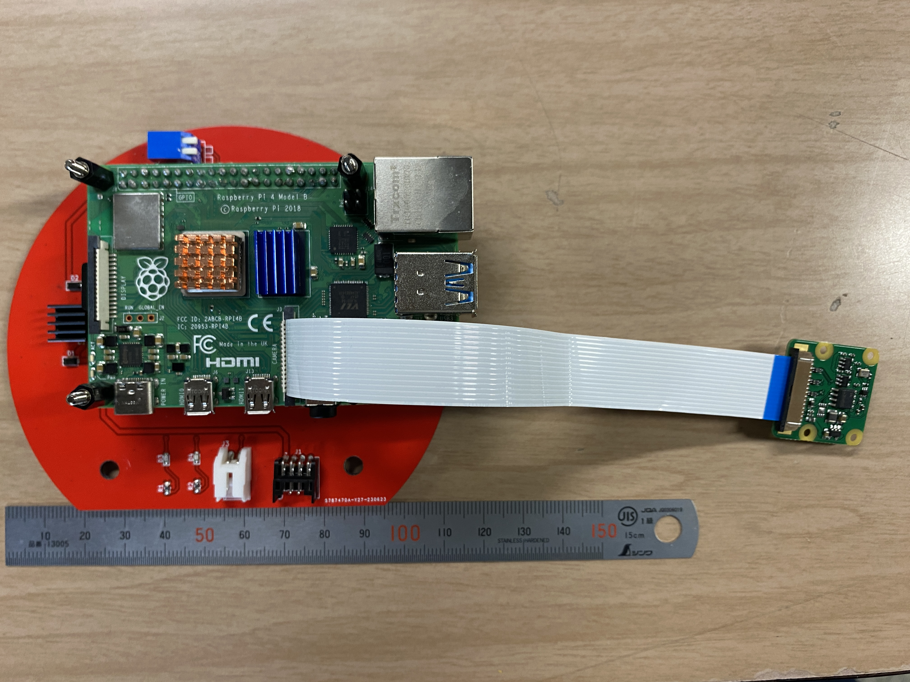

### 締結部品

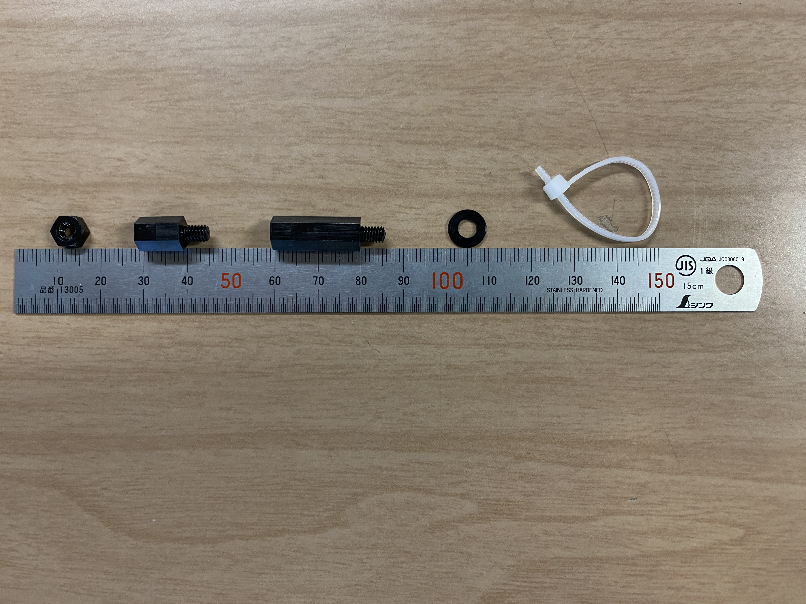

左から

- M4 ナット (4個)
- M4x10mm スペーサー (24個)
- M4x20mm スペーサー (8個)
- M4 ワッシャー (20個)
- アンテナ固定用タイラップ (6個)

## 組み立て方

### 電池交換

### 計器タワー組み立て

#### 0. 計器ベースプレートの準備

> aside={部品}
>
> 1x 計器ベースプレート
>

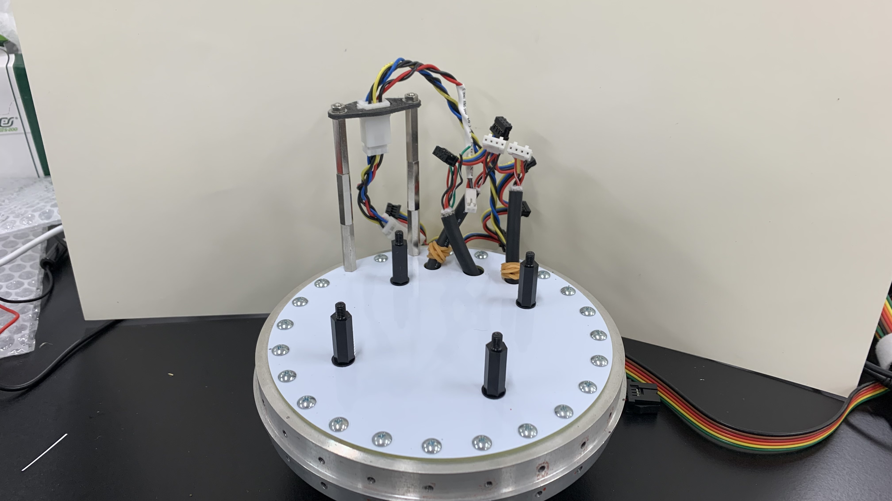

> note
>
> 運用時は写真の状態から解体することはありません。

#### 1. 電池ボックス基板取り付け

> aside={部品}
>
> 1x 電池ボックス基板
> 4x M4x20mm スペーサー

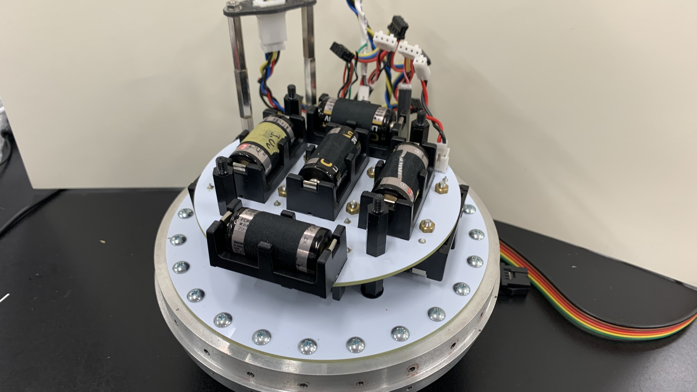

### 配線接続

### 計器チューブ取り付け
